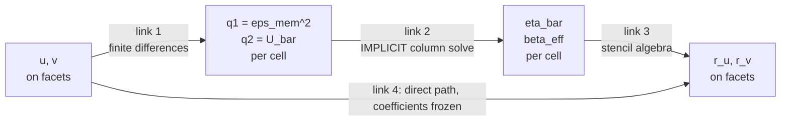
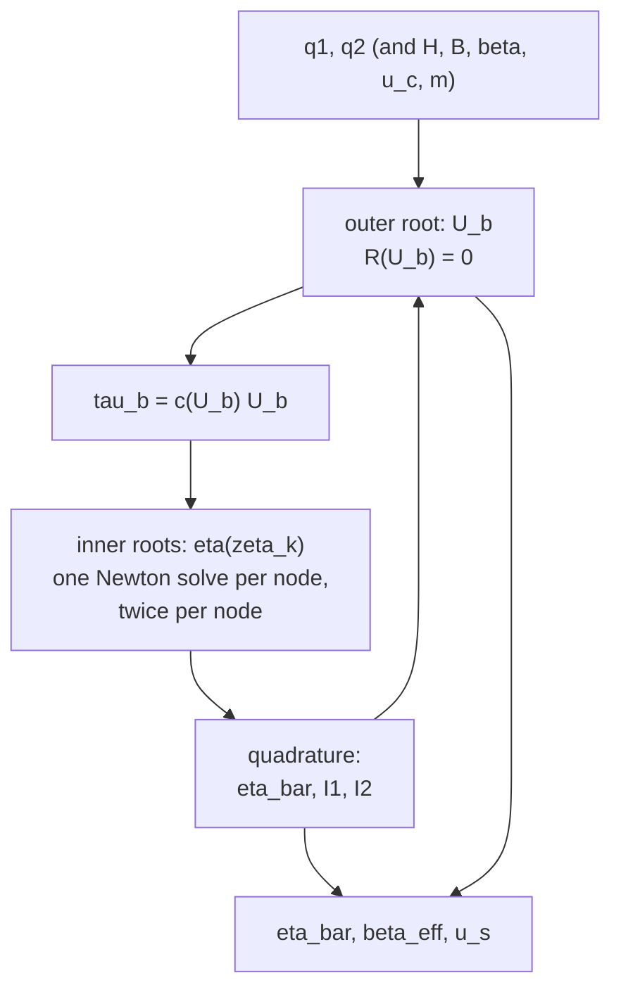
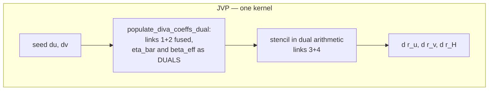
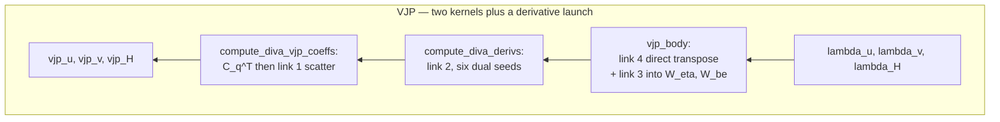
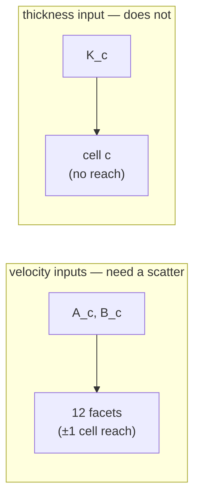

# A facet-level map of the DIVA adjoint

This note answers one question, concretely and row by row:

> Take a single residual row — the $x$-momentum row on a vertical facet, the $y$-momentum row on a horizontal facet, or the mass row at a cell centre. Which partial derivatives does that row need, where does each one come from, and what happens to the ones that are only defined implicitly?

[diva_numerics.md](diva_numerics.md) develops the forward model and [diva_adjoint.md](diva_adjoint.md) gives the structural argument for the reduced adjoint. This note is the atlas that sits between them: every partial that the implementation actually forms, drawn on the grid it lives on, with the implicit ones — $\bar\eta$ and $\beta_{\mathrm{eff}}$ — traced through the machinery that makes them differentiable.

The short version, which the rest of the note unpacks:

> A momentum row needs partials with respect to two *kinds* of thing: state values it reads directly, and coefficients it reads from nearby cells. The direct partials are ordinary stencil algebra. The coefficient partials split into an ordinary part (how the row uses a coefficient) and an implicit part (how that coefficient answers to velocity). Only the implicit part is hard, only one cell's worth of it is ever needed at a time, and it is compressed into a $2\times2$ matrix per cell by running the column solve in dual arithmetic.

------------------------------------------------------------------------

## 1. Where everything lives

GLIDE is staggered. One CUDA thread owns one cell and writes three residual rows: the mass row at its centre, the $x$-momentum row on its **left** facet, and the $y$-momentum row on its **top** facet. The right and bottom facets belong to neighbouring threads. Row indices increase *downward*, so `i-1` is "above" and `i+1` is "below".

```         
                        v(i,j)                  v(i,j+1)
                          ▲                        ▲
              ┌───────────┼────────────┬───────────┼────────────┐
              │                        │                        │
              │      cell (i,j)        │     cell (i,j+1)       │
     u(i,j) ──▶   H   phi   B   beta   │──▶ u(i,j+1)            │──▶ u(i,j+2)
              │   eta_bar  beta_eff    │                        │
              │   U_b   F1   F2   u_s  │                        │
              │                        │                        │
              └───────────┼────────────┴───────────┼────────────┘
                          ▲                        ▲
                       v(i+1,j)               v(i+1,j+1)

   rows written by the thread owning cell (i,j):
     r_H at the centre        r_u on facet u(i,j)        r_v on facet v(i,j)
```

Everything DIVA adds is **cell-centred**: `eta_bar`, `beta_eff`, `U_b`, `F1`, `F2`, `u_s`. Nothing new is stored on facets, and no vertical array exists anywhere. That single fact is what keeps the adjoint two-dimensional.

The two *inputs* to a cell's column closure are also cell-centred, but they are assembled from facets:

$$q_{1,c}=\dot\varepsilon_{\mathrm{mem},c}^2,
\qquad
q_{2,c}=\bar U_c,
\qquad
C_c=\begin{bmatrix}\bar\eta_c\\ \beta_{\mathrm{eff},c}\end{bmatrix}
   =\mathcal C_c(q_{1,c},q_{2,c};H_c,B_c,\beta_c,u_{c,c},m_s).$$

------------------------------------------------------------------------

## 2. The chain, and which links are hard

Every derivative in the DIVA momentum block is a product of four links:



The classification is the whole point of the design:

| Link | What it is | Derivative obtained by | Reach |
|------------------|------------------|------------------|------------------|
| 1\. facets → cell inputs | centred differences and a 2-norm | analytic partials, hand-written once | $\pm1$ cell |
| 2\. cell inputs → coefficients | nested Newton solves + quadrature | **dual arithmetic through the solver** | 0 (cell-local) |
| 3\. coefficients → residual rows | products and 4-point averages | analytic partials in the `*Jacobian` structs | $\pm1$ cell |
| 4\. state → residual rows, $C$ frozen | the SSA stencil | the existing SSA Jacobian structs | $\pm1$ facet |

Links 1, 3, and 4 are closed-form, differentiated by hand, and verified by the same tests that cover SSA. Link 2 has no closed form and is the only place where anything unusual happens. Sections 4–6 walk the atlas of links 3 and 4 row by row; Section 7 does link 2; Section 8 does link 1.

------------------------------------------------------------------------

## 3. Reading the residual as a sum of terms

Both momentum rows are assembled term by term, and *each term contributes its own partials to its own stencil*. Writing the $x$-momentum row on facet $u(i,j)$, the left facet of cell $c=(i,j)$, with $l=(i,j-1)$:

$$r_u=\underbrace{\frac{\sigma_{xx,c}-\sigma_{xx,l}}{\Delta x}}_{\text{normal}}
   +\underbrace{\frac{\sigma_{xy,\mathrm{tl}}-\sigma_{xy,\mathrm{bl}}}{\Delta x}}_{\text{shear}}
   +\underbrace{\tau_{b,x}}_{\text{drag}}
   -\underbrace{\tau_{d,x}}_{\text{driving}}
   -f_u,$$

with

$$\sigma_{xx}=2(\bar\eta H)_{\text{cell}}\,\varepsilon_{xx},
\qquad
\sigma_{xy}=2(\bar\eta H)_{\text{vertex}}\,\varepsilon_{xy},
\qquad
\tau_{b,x}=-\tfrac12(\beta_{\mathrm{eff},l}+\beta_{\mathrm{eff},c})\,u.$$

The two stress terms are where $\bar\eta$ enters; the drag term is where $\beta_{\mathrm{eff}}$ enters. Note the asymmetry that trips people up: the normal stress reads $\bar\eta$ from **one cell each**, while a vertex shear stress averages $\bar\eta H$ over the **four cells meeting at that corner**:

$$(\bar\eta H)_{\text{vertex}}=\tfrac14\sum_{k=1}^{4}\bar\eta_kH_k
\quad\Longrightarrow\quad
\frac{\partial(\bar\eta H)_{\text{vertex}}}{\partial\bar\eta_k}=\frac{H_k}{4}.$$

That $\tfrac14$ is why one row can reach six cells' worth of viscosity.

------------------------------------------------------------------------

## 4. Atlas: the $x$-momentum row on a vertical facet

### 4.1 Coefficient support

```         
             j-1           j
         ┌─────────┬─────────┐
   i-1   │   tl    │    t    │     eta_bar only
         │         │         │     (from the upper vertex)
         ├─────────┼─────────┤
         │         │         │
   i     │    l    ║    c    │     eta_bar AND beta_eff
         │         ║         │
         ├─────────╫─────────┤     ║ = the facet u(i,j)
   i+1   │   bl    │    b    │       carrying this row
         │         │         │     eta_bar only
         └─────────┴─────────┘       (from the lower vertex)

   N_eta(r_u) = { tl, t, l, c, bl, b }      six cells
   N_beta(r_u) = { l, c }                   two cells
```

### 4.2 Every coefficient partial, term by term

Let $\varepsilon_{xx,k}=2\partial_x\bar u+\partial_y\bar v$ evaluated in cell $k$ (the code's `eps_xx`), and $\varepsilon_{xy,V}$ the corner strain at vertex $V$.

| Term | Coefficient | Partial | Code |
|------------------|------------------|------------------|------------------|
| $+\sigma_{xx,c}/\Delta x$ | $\bar\eta_c$ | $+2\varepsilon_{xx,c}H_c/\Delta x$ | `d_eta_H * eta_H_c.d_eta` |
| $-\sigma_{xx,l}/\Delta x$ | $\bar\eta_l$ | $-2\varepsilon_{xx,l}H_l/\Delta x$ | same, negated |
| $+\sigma_{xy,\mathrm{tl}}/\Delta x$ | $\bar\eta_k,\ k\in\{tl,t,l,c\}$ | $+2\varepsilon_{xy,\mathrm{tl}}H_k/(4\Delta x)$ | `eta_H_tl.d_eta_*` |
| $-\sigma_{xy,\mathrm{bl}}/\Delta x$ | $\bar\eta_k,\ k\in\{l,c,bl,b\}$ | $-2\varepsilon_{xy,\mathrm{bl}}H_k/(4\Delta x)$ | `eta_H_bl.d_eta_*` |
| $\tau_{b,x}$ | $\beta_{\mathrm{eff},l}$ | $-u/2$ | `d_beta_eff_l` |
| $\tau_{b,x}$ | $\beta_{\mathrm{eff},c}$ | $-u/2$ | `d_beta_eff_r` |
| $\tau_{d,x}$ | — | none | driving stress reads no coefficient |

Cells $l$ and $c$ appear three times each (once from a normal stress, twice from the two vertices); the accumulation below simply adds all of them.

### 4.3 What the row does with them

`vjp_body` does not try to finish the coefficient path. For a residual cotangent $\lambda_u$ on this facet it deposits each product onto the **owning cell**:

$$W_{\eta,k}\mathrel{+}=\lambda_u\frac{\partial r_u}{\partial\bar\eta_k},
\qquad
W_{\beta,k}\mathrel{+}=\lambda_u\frac{\partial r_u}{\partial\beta_{\mathrm{eff},k}} ,$$

via `diva_add_W`. Read the two arrays as the answer to: *after contraction with the adjoint, how much does the objective care about each coefficient this cell produced?* At that point the row is finished; the rest of the path belongs to the cell, not the row.

------------------------------------------------------------------------

## 5. Atlas: the $y$-momentum row on a horizontal facet

The same picture rotated. The row lives on the top facet of cell $c$, so its two normal stresses come from the cells above and below it, and its two vertex shear stresses sit at the facet's left and right ends.

```         
             j-1           j          j+1
         ┌─────────┬─────────┬─────────┐
   i-1   │   tl    │    t    │   tr    │    t: eta_bar AND beta_eff
         │         │         │         │    tl, tr: eta_bar only
         ├─────────╪═════════╪─────────┤    ═ = the facet v(i,j)
   i     │    l    │    c    │    r    │    c: eta_bar AND beta_eff
         │         │         │         │    l, r: eta_bar only
         └─────────┴─────────┴─────────┘

   N_eta(r_v) = { tl, t, tr, l, c, r }      six cells
   N_beta(r_v) = { t, c }                   two cells
```

| Term | Coefficient | Partial |
|------------------------|------------------------|------------------------|
| $+\sigma_{yy,t}/\Delta x$ | $\bar\eta_t$ | $+2\varepsilon_{yy,t}H_t/\Delta x$ |
| $-\sigma_{yy,c}/\Delta x$ | $\bar\eta_c$ | $-2\varepsilon_{yy,c}H_c/\Delta x$ |
| $-\sigma_{xy,\mathrm{tl}}/\Delta x$ | $\bar\eta_k,\ k\in\{tl,t,l,c\}$ | $-2\varepsilon_{xy,\mathrm{tl}}H_k/(4\Delta x)$ |
| $+\sigma_{xy,\mathrm{tr}}/\Delta x$ | $\bar\eta_k,\ k\in\{t,tr,c,r\}$ | $+2\varepsilon_{xy,\mathrm{tr}}H_k/(4\Delta x)$ |
| $\tau_{b,y}$ | $\beta_{\mathrm{eff},t},\ \beta_{\mathrm{eff},c}$ | $-v/2$ each |

Note the sign flip on the shear terms relative to the $u$-row: $r_u$ takes $\partial_y\sigma_{xy}$ (upper minus lower) while $r_v$ takes $\partial_x\sigma_{xy}$ (right minus left), and the vertex labelled `tl` is the *upper* vertex of the $u$-facet but the *left* vertex of the $v$-facet.

------------------------------------------------------------------------

## 6. Atlas: the mass row at a cell centre

$r_H$ reads no DIVA coefficient at all:

$$r_H=\frac{H}{\Delta t}-\left(\frac{H^{\text{prev}}}{\Delta t}+\dot b\right)
   +\nabla\!\cdot(\bar{\mathbf u}H)+\text{calving},$$

and the velocity that appears is the depth average, which *is* the global unknown. So the mass row contributes to $\lambda^T J$ through fluxes only, and adds nothing to $W_\eta$ or $W_\beta$.

This is worth stating explicitly because it is the reason the DIVA adjoint has no third pass: the coefficient path exists in exactly two of the three residual families.

Two consequences that are easy to miss:

- The vertical structure is invisible to mass conservation *by construction* — DIVA transports the depth average, so the $\mathcal I_1$/$\mathcal I_2$ machinery never enters the continuity equation.
- $r_H$ still supplies velocity cotangents, and those cotangents are added to the same `vjp_u`/`vjp_v` arrays that the coefficient scatter writes into. The two contributions are independent; nothing about the coefficient path changes the flux transpose.

------------------------------------------------------------------------

## 7. Link 2: the implicit coefficients

This is the only genuinely hard link, so it gets the longest section.

### 7.1 What "implicit" means here, precisely

Given $q_1,q_2$ in a cell, the closure runs:

```         
outer Newton on U_b:                       R(U_b) = U_b + f(U_b) I2(f(U_b)) - Ubar = 0
    tau_b = c(U_b) * U_b
    for k in quadrature nodes (Gauss-Legendre on zeta in [0,1]):
        inner Newton on eta_mem:           eta = 0.5 B (q1 + eps_reg       + tau_b^2 zeta^2 / 4 eta^2)^p
        inner Newton on eta_sh:            eta = 0.5 B (q1 + eps_reg_shear + tau_b^2 zeta^2 / 4 eta^2)^p
        accumulate eta_bar, I1, I2, dI2/dtau_b
    Newton step with R' = 1 + f' I2 + f f' dI2/dtau_b
final quadrature at the accepted traction
eta_bar = sum w_k eta_mem,k          beta_eff = c(U_b) / (1 + c(U_b) I2)
```

There are therefore **two nested levels of implicitness**, both of them scalar and both of them cell-local:



The cycle in that diagram is the outer Newton loop: $\mathcal I_2$ is needed to find $U_b$, and $U_b$ sets the traction that determines $\mathcal I_2$. Writing a closed-form $\partial\bar\eta/\partial q_1$ would mean differentiating a fixed point of a fixed point, once per sliding law, and keeping it in step with the solver forever.

### 7.2 The device: dual arithmetic plus one extra Newton step

`diva_coeffs_cell<T>` is templated on the scalar type. With `T = float` it is the diagnostic kernel; with `T = DualFloat` the *same source* carries a value and one directional derivative through every operation — quadrature, both Newton loops, the `__powf` calls, everything. The derivative therefore follows exactly the program that produced the value, with nothing hand-derived and nothing to keep in sync.

The subtlety that makes this legitimate is the termination rule. For a scalar root $y(x)$ with $F(y,x)=0$ and Newton map $N(y,x)=y-F/F_y$, differentiating one application *at the converged root* gives

$$\dot y^+=\dot y-\frac{F_y\dot y+F_x\dot x}{F_y}=-\frac{F_x}{F_y}\dot x .$$

The incoming $\dot y$ **cancels**. Whatever derivative the iteration accumulated along the way — including the derivative of the warm start, which is seeded to zero and is meaningless — is replaced by the implicit-function-theorem answer. Both loops in `diva_coeffs_cell` therefore take **exactly one more iteration after the primal convergence test fires**:

```         
if (closure_primal_ok) { closure_ok = true; break; }   // the derivative's pass
if (F_rel <= closure_tol || stagnated) closure_primal_ok = true;
```

Two corollaries that the code depends on:

1.  **Newton denominators may be taken from primals.** $R'$ is assembled from `float` quantities even when `T = DualFloat`. An inexact denominator costs iterations, never accuracy, because the converged root and its sensitivity do not depend on the step size used to reach them. *A term dropped from a residual has no such licence* — which is why `k_shear` must be typed `T`.
2.  **No global adjoint solve for** $U_b$ is needed. An augmented formulation carrying $U_b$ and the node viscosities as unknowns would produce local constraint blocks; eliminating them yields exactly what these final dual Newton steps compute directly.

### 7.3 What gets stored

`compute_diva_derivs` runs the closure once per seed and stores the dual parts. Six seeds, three outputs each, eighteen cell-centred fields:

| Seed | Perturbed input | Fields stored | Used for |
|------------------|------------------|------------------|------------------|
| 1 | $q_1=\dot\varepsilon_{\mathrm{mem}}^2$ | $\bar\eta_{,q_1},\ \beta_{\mathrm{eff},q_1},\ U_{s,q_1}$ | velocity transpose |
| 2 | $q_2=\bar U$ | $\bar\eta_{,q_2},\ \beta_{\mathrm{eff},q_2},\ U_{s,q_2}$ | velocity transpose |
| 3 | $H$ | $\bar\eta_{,H},\ \beta_{\mathrm{eff},H},\ U_{s,H}$ | **thickness** block of the transpose (§12) |
| 4 | $\beta$ (seeded with $\varphi$) | $\bar\eta_{,\beta},\ \beta_{\mathrm{eff},\beta},\ U_{s,\beta}$ | drag gradient |
| 5 | $u_c$ | three | Coulomb gradient |
| 6 | $m_s$ | three | Weertman-exponent gradient |

Seed 3 is worth pausing on. It perturbs $\beta$ and reads a nonzero $\bar\eta_{,\beta}$: more drag $\to$ more traction $\to$ more vertical shear $\to$ softer ice. That path does not exist in SSA and was missing from the parameter gradient at one point. The dual mechanism supplies it for free — precisely because it differentiates the program rather than a formula someone believed was complete.

For the velocity block only the first two seeds matter, and they form the $2\times2$ matrix

$$C_{q,c}=
\begin{bmatrix}
\bar\eta_{,q_1} & \bar\eta_{,q_2}\\[2pt]
\beta_{\mathrm{eff},q_1} & \beta_{\mathrm{eff},q_2}
\end{bmatrix}_c .$$

Everything nested — every node viscosity, the quadrature, the basal-speed root — has been compressed into four numbers per cell.

### 7.4 Applying its transpose

`compute_diva_vjp_coeffs` then contracts the row-side weights with the closure-side Jacobian, one thread per cell:

$$\begin{bmatrix}A_c\\B_c\end{bmatrix}
=C_{q,c}^{\,T}
\begin{bmatrix}W_{\eta,c}\\W_{\beta,c}\end{bmatrix}
=\begin{bmatrix}
W_{\eta,c}\bar\eta_{,q_1}+W_{\beta,c}\beta_{\mathrm{eff},q_1}\\[2pt]
W_{\eta,c}\bar\eta_{,q_2}+W_{\beta,c}\beta_{\mathrm{eff},q_2}
\end{bmatrix}.$$

$A_c$ and $B_c$ are cotangents on the two closure *inputs*. The implicit part of the problem ends here.

------------------------------------------------------------------------

## 8. Link 1: cell inputs back to facets

The last step transposes the finite differences that built $q_1$ and $q_2$. `diva_scatter_cell_to_facets` rebuilds exactly the strains that `membrane_eps_sq` formed — including the four boundary masks, which are geometry and carry no derivative — and applies their analytic partials.

For $q_2=\bar U_c$, with $u_{\mathrm{ctr}}=\tfrac12(u_l+u_r)$ and $v_{\mathrm{ctr}}=\tfrac12(v_t+v_b)$:

$$\frac{\partial\bar U_c}{\partial u_l}=\frac{\partial\bar U_c}{\partial u_r}
=\frac{u_{\mathrm{ctr}}}{2\bar U_c},
\qquad
\frac{\partial\bar U_c}{\partial v_t}=\frac{\partial\bar U_c}{\partial v_b}
=\frac{v_{\mathrm{ctr}}}{2\bar U_c},$$

set to zero below $\bar U_c=10^{-6}$ so the undefined direction at rest cannot produce a NaN. These four partials reach only the cell's own bounding facets.

For $q_1=\dot\varepsilon_{xx}^2+\dot\varepsilon_{yy}^2
+\dot\varepsilon_{xx}\dot\varepsilon_{yy}+\overline{\dot\varepsilon_{xy}^2}$ the first three terms reach the same four facets, but the corner-averaged shear term reaches **eight more**. With $P=2\dot\varepsilon_{xx}+\dot\varepsilon_{yy}$, $Q=2\dot\varepsilon_{yy}+\dot\varepsilon_{xx}$ and $R_V=\tfrac12\dot\varepsilon_{xy,V}$ for each corner $V$, the full scatter is twelve facets:

```         
                    u(i-1,j)      u(i-1,j+1)
                       ▲              ▲            A only (corner shear)
        ┌──────────────┼──────────────┼──────────────┐
        │              │              │              │
 v(i,j-1)◀             │   v(i,j) ▲   │             ▶v(i,j+1)     A only
        │              │              │              │
        ├──────────────┼══════════════┼──────────────┤
        │              ║   CELL c     ║              │
 u(i,j) ▶ ─────────────║   A, B       ║───────────── ◀ u(i,j+1)   A and B
        │              ║              ║              │
        ├──────────────┼══════════════┼──────────────┤
        │              │  v(i+1,j) ▲  │              │            A and B
 v(i+1,j-1)◀           │              │            ▶v(i+1,j+1)    A only
        └──────────────┼──────────────┼──────────────┘
                       ▲              ▲
                    u(i+1,j)      u(i+1,j+1)         A only
```

| Facet | Contribution added |
|----|----|
| $u(i,j)$ | $A(-P/\Delta x-R_{tl}h+R_{bl}h)+B\,\partial_u\bar U$ |
| $u(i,j{+}1)$ | $A(+P/\Delta x-R_{tr}h+R_{br}h)+B\,\partial_u\bar U$ |
| $v(i,j)$ | $A(+Q/\Delta x+R_{tl}h-R_{tr}h)+B\,\partial_v\bar U$ |
| $v(i{+}1,j)$ | $A(-Q/\Delta x+R_{bl}h-R_{br}h)+B\,\partial_v\bar U$ |
| $u(i{-}1,j)$, $u(i{-}1,j{+}1)$ | $A(+R_{tl}h)$, $A(+R_{tr}h)$ |
| $u(i{+}1,j)$, $u(i{+}1,j{+}1)$ | $A(-R_{bl}h)$, $A(-R_{br}h)$ |
| $v(i,j{-}1)$, $v(i,j{+}1)$ | $A(-R_{tl}h)$, $A(+R_{tr}h)$ |
| $v(i{+}1,j{-}1)$, $v(i{+}1,j{+}1)$ | $A(-R_{bl}h)$, $A(+R_{br}h)$ |

with $h=1/(2\Delta x)$. Only the four bounding facets receive a $B$ term, because only they enter $\bar U_c$.

**Dirichlet facets are skipped**, by the same bounds test the main VJP flush uses ($0<j<n_x$ for $u$, $0<i<n_y$ for $v$). Those rows were replaced by an identity in the forward residual, so anything deposited on them is unreducible by the smoother and would sit in the adjoint residual forever as a convergence floor. This is a real failure mode, not a hypothetical one.

------------------------------------------------------------------------

## 9. Why the transpose is split at the cell

Compose links 3 and 1 and the coefficient path reaches $\pm2$ cells: a row reads $\bar\eta$ from a cell one step away, and that cell's closure reads facets one step beyond it. A single fused kernel would need a two-cell halo, doubling the halo cost of every DIVA adjoint launch.

Splitting at the cell keeps both halves within the existing $\pm1$ halo:

```         
   FUSED (not used):     row ────────── ±2 ──────────▶ facet

   SPLIT (used):         row ─── ±1 ──▶ cell ─── ±1 ──▶ facet
                          vjp_body        compute_diva_vjp_coeffs
                          (W_eta, W_be)   (A, B → scatter)
```

The cell is the natural cut point for a second reason: it is exactly where the implicit part of the problem lives. $W_\eta,W_\beta$ are everything the rows know; $C_{q}$ is everything the column knows; $A,B$ is their product. Each kernel deals with one kind of derivative.

------------------------------------------------------------------------

## 10. Traversal order: forward versus reverse

The same four links, walked in opposite directions.





The asymmetry is inherent to the modes, not an implementation quirk. Forward mode can fuse links 1 and 2 because it pushes a *known* input direction through the closure — `populate_diva_coeffs_dual` seeds the velocity perturbation directly and the tile holds dual $\bar\eta$ and $\beta_{\mathrm{eff}}$, so the stencil that follows is ordinary dual arithmetic. Reverse mode cannot, because the coefficient cotangent is not known until every row that reads the cell has been visited. Hence the barrier at the cell, and hence the two passes.

### One thing that looks like an omission and is not

Under DIVA, `vjp_body` loads the viscosity tile with a **zero** dual part:

``` cpp
eta_local[bi][bj] = {get_cell(eta_bar, i, j, ny, nx), 0.0f};
```

whereas the SSA branch seeds it with $\lambda$. That is not a dropped term; it is a deferred one — deferred to $W_\eta$ and then to `compute_diva_vjp_coeffs`.

The SSA branch can seed with $\lambda$ because the frozen-coefficient membrane operator is self-adjoint, so applying $J$ to $\lambda$ and depositing it on the row's own facet *is* the transpose, and under SSA the viscosity-through-velocity path inherits that symmetry too. DIVA's closure path has no such guarantee — an implicit basal-speed solve with a general sliding law is not symmetric — so the DIVA path assumes nothing about it and transposes it explicitly. The direct stencil terms still use the self-adjointness of the frozen block; the *coefficient* terms use none.

If you want the measurement rather than the argument: turning `diva_exact_coeff_adjoint` off drops exactly this path and the dot-product identity degrades from $5\times10^{-7}$ to $9.7\times10^{-2}$.

------------------------------------------------------------------------

## 11. Approximations that are deliberate

Not every derivative in the code is the exact one, and the distinction matters:

| Where | Derivative used | Why it is allowed |
|------------------------|------------------------|------------------------|
| nonlinear residual | $\beta_{\mathrm{eff}}=c/(1+c\mathcal I_2)$ — a *ratio*, not a derivative | it is the definition of the drag term |
| Vanka smoother | the **secant** drag $\beta_{\mathrm{eff}}=\tau_b/\bar U$, a frozen coefficient | a preconditioner; changing it changes iteration counts, never the converged answer. The block's unknowns are $(u_l,u_r,v_t,v_b,H_c)$ and it never sees $U_b$ — see diva_numerics.md 5.2 |
| JVP / VJP | $d\tau_b/d\bar U=f'/(1+f'\mathcal I_2+ff'\,d\mathcal I_2/d\tau_b)$ | must represent the converged equations, so nothing may be frozen |

The Vanka block's unknowns are $(u_l,u_r,v_t,v_b,H_c)$ and it never sees $U_b$ — that is diagnosed by `compute_diva_coeffs` and re-solved to tolerance after every smoothing application. It is the right place to approximate, and an earlier version that *did* carry $U_b$ as a sixth local unknown had to be removed: for $m_s<1$ it left the $5\times5$ near-singular in a few cells and the solve diverged to NaN on real geometry (diva_numerics.md 5.2).

------------------------------------------------------------------------

## 12. Thickness: the fourth input to link 2

For a long time everything above held only at **fixed thickness**, and this section documented the gap. It is now closed, and the way it closed is worth keeping, because it is the cheapest possible version of a change that sounds expensive.

Thickness enters the closure in exactly **one** place. The quadrature runs over $\zeta\in[0,1]$, so $H$ appears only as the factor carried by the shear moments:

$$\mathcal I_\alpha=H_c\!\int_0^1\!\frac{\zeta^\alpha}{\eta(\zeta)}\,d\zeta .$$

Everything else — the level viscosities, the sliding law, the basal-speed root — depends on $H$ only *through* those two integrals. So typing `H_c` as `T` in `diva_coeffs_cell` captures the entire path

$$H\longrightarrow\mathcal I_1,\mathcal I_2
\longrightarrow U_b,\tau_b
\longrightarrow\bar\eta,\beta_{\mathrm{eff}},U_s ,$$

and a sixth dual seed produces $\bar\eta_{,H}$, $\beta_{\mathrm{eff},H}$ and $U_{s,H}$ with no new derivation. Same argument as §7.2: differentiate the program, not a formula.

### The reverse direction is simpler than the velocity one

The velocity inputs $q_1,q_2$ are *assembled from surrounding facets*, so their transpose is a twelve-facet scatter (§8). $H_c$ is the cell's **own** value, so its transpose is a single number landing on a single cell:

$$K_c=W_{\eta,c}\,\bar\eta_{,H}+W_{\beta,c}\,\beta_{\mathrm{eff},H},$$

accumulated into the thickness cotangent that `vjp_body` already built from the direct terms ($H\bar\eta$, driving stress, fluxes, calving). No stencil, no atomics, no halo. A surface objective gains its counterpart the same way: $\mathrm{cot}_c\,U_{s,H}$, into the same cell.



### What verifying it required

The note this section replaces made a prediction: *because the term was absent from both operators, the dot-product test could not see it, and only a finite-difference test in a thickness direction could.* That was half right, and the measured sensitivities are worth recording. Each was obtained by disabling the closure's `H` seed and re-running.

| Check | With the H path | Without it | Sensitivity |
|---|---|---|---|
| closure derivatives vs FD (`diva_derivs_test`) | $\le10^{-4}$ | n/a — the field does not exist | decisive |
| residual JVP vs FD, $\delta H$ direction | $5.7\times10^{-5}$ | $1.2\times10^{-4}$ | **only ~2×** |
| dot-product identity, $\delta H\ne0$ | $1.3\times10^{-7}$ | $2.6\times10^{-5}$ | ~200× |

The thickness-direction finite difference — the check the old note nominated as load-bearing — is **coarse**. The residual's explicit $H$ dependence dominates its response to thickness, so the closure-mediated part is a small correction on a large signal. It catches a gross error, not a subtle one.

The dot-product test is sharp here only because the probe removed the term from *one* side. Remove it from both and it goes quiet again, exactly as the old note warned. What actually pins this path down is the direct closure-derivative test, which finite-differences $\bar\eta_{,H}$, $\beta_{\mathrm{eff},H}$ and $U_{s,H}$ in isolation, where there is no large direct term to hide behind.

> The general lesson survives, sharpened: a transpose test proves consistency between two operators and never completeness of either — and an end-to-end finite difference can be too *insensitive* to substitute for it. Test each link where its own signal is largest.

### Still outside this path

The grounded fraction $\varphi(H)$ remains a separate classification question: holding $\varphi$ fixed and differentiating the diagnostic map $H\mapsto\varphi$ are different linearizations and should not be conflated. The Vanka smoother also still freezes the column (§11), which is a preconditioner choice and does not affect the converged answer.

------------------------------------------------------------------------

## 13. Checklist: adding a new dependency to the closure

If a new input $p$ enters `diva_coeffs_cell`, the map above says exactly what must follow:

1.  Type it `T`, not `float`, or its derivative is silently zero.
2.  Add a seed in `compute_diva_derivs` and the fields to store its three dual parts.
3.  Decide which link it belongs to. Cell-local parameter ($\beta$, $u_c$, $m_s$): contract with $W_\eta,W_\beta$ and you are done. State-dependent ($H$, temperature): it also needs a JVP contribution and a scatter to whatever grid it lives on.
4.  Extend the finite-difference cell test (`diva_derivs_test.py`) — this is the only test that can see a *new* path.
5.  Only then check the dot-product identity, which confirms the two operators agree but cannot confirm they are complete.

------------------------------------------------------------------------

## Code landmarks

| Role | Location |
|------------------------------------|------------------------------------|
| residual stencil, both schemes | `glide/cuda/residuals.cu`: `residual_body<DIVA>` |
| first VJP pass, $W_\eta$/$W_\beta$ accumulation | `glide/cuda/residuals.cu`: `vjp_body<DIVA>`, `diva_add_W` |
| forward-mode fused closure | `glide/cuda/diva.cu`: `populate_diva_coeffs_dual` |
| the column closure itself | `glide/cuda/diva.cu`: `diva_coeffs_cell<T>`, `diva_level_viscosity<T>` |
| six dual seeds | `glide/cuda/diva.cu`: `compute_diva_derivs` |
| $C_q^T$ contraction and cell→facet scatter | `glide/cuda/diva.cu`: `compute_diva_vjp_coeffs`, `diva_scatter_cell_to_facets` |
| surface-speed objective transpose | `glide/cuda/diva.cu`: `compute_diva_us_vjp` |
| coefficient partials ($\partial\sigma/\partial\bar\eta H$, vertex $\tfrac14$) | `glide/cuda/stress.cu`, `glide/cuda/viscosity.cu` |
| dual scalar type | `glide/cuda/common.cu`: `DualFloat` |
| two-pass orchestration | `glide/operators.py`: `_apply_diva_coeff_adjoints` |